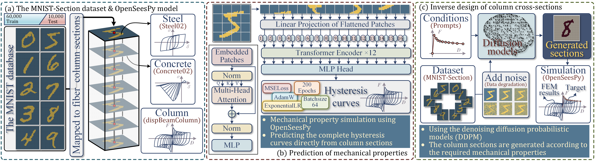
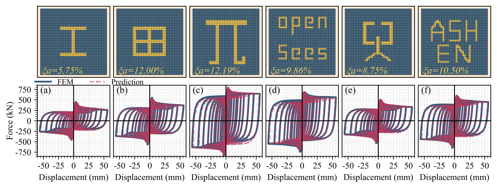
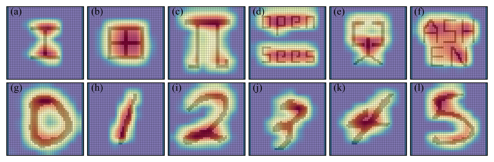

<div align=center>
  
# Prediction of Mechanical Properties and Inverse Design of Complex Cross-Sectional Columns (CCSCs)
  
</div> 

<!-- 反向设计 -->
* ## **_Conditional diffusion for cross-section generation_**
<div align=center>
  
  
  
  
   <div align=center><strong>Results of the inverse design of complex cross-sections</strong></div>
</div><br>    

* ## ⚛️ **_Datasets & Pre-trained models_**    
[**✅The MNIST-Section dataset**](https://github.com/AshenOneme/CCSC-Prediction-Inverse-Design/releases/tag/MNIST-Section-Dataset)     
[**✅The weights of the ViT & DDPM**](https://github.com/AshenOneme/CCSC-Prediction-Inverse-Design/releases/tag/ModelWeights)

<div align=center>
  
## 🌟🌟🌟🌟🌟🌟🌟🌟🌟🌟🌟🌟🌟🌟🌟🌟🌟🌟
  
</div> 

___

*__This research introduces a method for predicting the mechanical performance and inverse design of Complex Cross-Sectional Columns (CCSCs) based on deep learning algorithms. A series of data-driven investigations were conducted from both forward prediction and inverse generation perspectives.__*

<!-- 流程图 -->
* ## **_Workflow_**

In this work, to evaluate the effectiveness of the prediction and generation methods, a substantial dataset of column cross-sections is required. Currently, such an extensive database is not readily available. Therefore, the MNIST-Section dataset was developed based on the MNIST dataset by mapping handwritten digits to fiber cross-sections. Subsequently, OpenSeesPy was employed to perform the computations, resulting in a fiber model dataset comprising 70,000 columns.   
<div align=center>
  
  <div align=center><strong>Fig.1 The proposed workflow for mechanical properties prediction and design of CCSCs</strong></div>
</div><br>

<!-- 数据集 -->
* ## **_MNIST-Section Dataset_**

The digit portions were mapped to steel, while the remaining portions were mapped to concrete. Figure 2 illustrates the relationship between the proportion of steel in the cross-section and the strength degradation of the columns after loading, categorized into ten classes corresponding to the digits 0 through 9.
<div align=center>
  
  <div align=center><strong>Fig.2 The distribution of the proportion of steel area and the strength degradation rate</strong></div>
</div><br>

<!-- 正向预测 -->
* ## **_Prediction of the mechanical performance of CCSCs_**

The predictive model we developed, which maps column cross-sectional properties to mechanical performance, demonstrates robust predictive capabilities. In Figure 3, the **_blue_** line represents the results of numerical simulations, while the **_red_** line depicts the predicted results generated by the ViT model.
<div align=center>
  
  <div align=center><strong>Fig.3 The prediction results of ViT</strong></div>
</div><br>

* ## **_Transfer to more regular or more complex cross-sections_**

Although the dataset we utilized, MNIST-Section, lacks realism, the predictive model trained on this dataset is capable of accurately predicting the mechanical performance of both **_regular_** and **_more complex_**, non-standard cross-sections. The results, as shown in Figure 4, demonstrate the model's effectiveness even when applied to cross-sections that deviate from typical engineering scenarios.
<div align=center>
  
  <div align=center><strong>Fig.4 Prediction for more complex arbitrary cross-sections</strong></div>
</div><br>

<div align=center>
  
  <div align=center><strong>Fig.5 Grad-CAM heatmap visualization</strong></div>
</div><br>

<!-- 反向设计 -->
* ## **_DDPM for cross-section generation_**

Given the mechanical performance demands for the columns, the Denoising Diffusion Probabilistic Model (DDPM) can rapidly generate corresponding cross-sectional forms. Each generated cross-section undergoes mechanical performance evaluation using OpenSeesPy, which is then compared against the specified performance criteria. It is observed that as the number of sampling steps increases, the resulting cross-sections become more regular, and the finite element analysis results progressively converge towards the target mechanical performance.
<div align=center>
  
  <div align=center><strong>Fig.6 The process of section generation</strong></div>
</div><br>

# Notes
* To create arbitrary cross-sections in OpenSeesPy, you can use the Abaqus-to-OpenSeesPy conversion tool that I developed. The link to the tool is as follows:
[**✅A2O Section**](https://github.com/AshenOneme/Abaqus-To-OpenSeesPy-Section)
* Prior to conducting numerical modeling, I performed an analysis of the cyclic loading tests on columns using OpenSeesPy. This analysis confirmed that the software accurately represents the mechanical performance of the columns. The relevant code is provided below:
```Python
import openseespy.opensees as ops

ops.wipe() 
ops.model('basic', '-ndm', 2, '-ndf', 3) 

IDSteel = 1
Fy_Steel = 582
E0_Steel = 289850
bs_Steel = 0.0033
R0 = 16
cR1 = 0.925
cR2 = 0.15
ops.uniaxialMaterial('Steel02', IDSteel, Fy_Steel, E0_Steel, bs_Steel,R0,cR1,cR2)

IDcoverC=2
fpc_cover=-24.49
epsc0_cover=-0.002
fpcu_cover=-8.11
epsU_cover=-0.005
lambda_cover=0.1
ft_cover=2.4
Ets_cover=3000
ops.uniaxialMaterial('Concrete02', IDcoverC, fpc_cover, epsc0_cover, fpcu_cover, epsU_cover,lambda_cover,ft_cover,Ets_cover)

IDcoreC=3
fpc_cover=-29.39
epsc0_cover=-0.0025
fpcu_cover=-10.36
epsU_cover=-0.015
lambda_cover=0.1
ft_cover=2.8
Ets_cover=3000
ops.uniaxialMaterial('Concrete02', IDcoreC, fpc_cover, epsc0_cover, fpcu_cover, epsU_cover,lambda_cover,ft_cover,Ets_cover)

fiber_column_section=1
ops.section('Fiber', fiber_column_section)
ops.patch('rect', IDcoreC, 8,8,-80,-80,80,80)
ops.patch('rect', IDcoverC, 10,1, -100, 80,100,100)
ops.patch('rect', IDcoverC, 10,1,-100,-100,100,-80)
ops.patch('rect', IDcoverC, 1,8,-100,-80,-80,80)
ops.patch('rect', IDcoverC, 1,8,80,-80,100,80)
ops.layer('straight', IDSteel, 3,50.24,-80,80,80,80)
ops.layer('straight', IDSteel, 2,50.24,-80,0 ,80, 0)
ops.layer('straight', IDSteel, 3,50.24,-80,-80,80,-80)

# 节点坐标(x,y)
ops.node(1,0,0)
ops.node(2,0,150)
ops.node(3,0,300)
ops.node(4,0,450)
ops.node(5,0,600)
ops.node(6,0,750)

ops.fix(1,1,1,1)

coordTransf = "PDelta"  # Linear, PDelta, Corotational
IDColumnTransf=1
ops.geomTransf(coordTransf, IDColumnTransf)
numIntgrPts=8
IDColumnIntegration=1
ops.beamIntegration('Lobatto',IDColumnIntegration,fiber_column_section,numIntgrPts)

ops.element('dispBeamColumn',1,1,2,IDColumnTransf,IDColumnIntegration)
ops.element('dispBeamColumn',2,2,3,IDColumnTransf,IDColumnIntegration)
ops.element('dispBeamColumn',3,3,4,IDColumnTransf,IDColumnIntegration)
ops.element('dispBeamColumn',4,4,5,IDColumnTransf,IDColumnIntegration)
ops.element('dispBeamColumn',5,5,6,IDColumnTransf,IDColumnIntegration)

ops.timeSeries('Linear', 11)
ops.pattern('Plain', 100,11)
ops.load(6,0,-140780,0)
ops.constraints("Penalty",1e10,1e10)
# ops.constraints("Plain")
ops.numberer("RCM")
ops.system("BandGeneral")
ops.test('NormDispIncr', 1e-8, 100)
ops.algorithm("KrylovNewton")
ops.integrator("LoadControl",0.1)
ops.analysis("Static")
ops.analyze(10)
ops.loadConst("-time",0.0)

ops.recorder('Node', '-file', "Disp.txt","-time",'-node', 6, '-dof',1, 'disp')
ops.recorder('Node', '-file', "Reaction.txt","-time",'-node', 1, '-dof',1, 'reaction')

ops.timeSeries('Linear', 22)
ops.pattern( "Plain", 200,22)
ops.sp(6,1,1)
ops.test('NormDispIncr', 1e-8, 2000)

increment= [0.02, -0.02, -0.02, 0.02,
                0.02, -0.02, -0.02, 0.02,
            0.04, -0.04, -0.04, 0.04,
                0.04, -0.04, -0.04, 0.04,
            0.07, -0.07, -0.07, 0.07,
                0.07, -0.07, -0.07, 0.07,
            0.10, -0.10, -0.10, 0.10,
                0.10, -0.10, -0.10, 0.10,
            0.14, -0.14, -0.14, 0.14,
                0.14, -0.14, -0.14, 0.14,
            0.18, -0.18, -0.18, 0.18,
                0.18, -0.18, -0.18, 0.18,
            0.20, -0.20, -0.20, 0.20,
                0.20, -0.20, -0.20, 0.20,
            0.25, -0.25, -0.25, 0.25,
                0.25, -0.25, -0.25, 0.25,
            0.30, -0.30, -0.30, 0.30,
                0.30, -0.30, -0.30, 0.30,
            0.38, -0.38, -0.38, 0.38,
                0.38, -0.38, -0.38, 0.38,
            0.46, -0.46, -0.46, 0.46,
                0.46, -0.46, -0.46, 0.46,
            0.56, -0.56, -0.56, 0.56,
                0.56, -0.56, -0.56, 0.56,
            ]

for i in range(96):
    ops.integrator("DisplacementControl",6,1,increment[i])
    ops.analysis("Static")
    ops.analyze(100)
```
